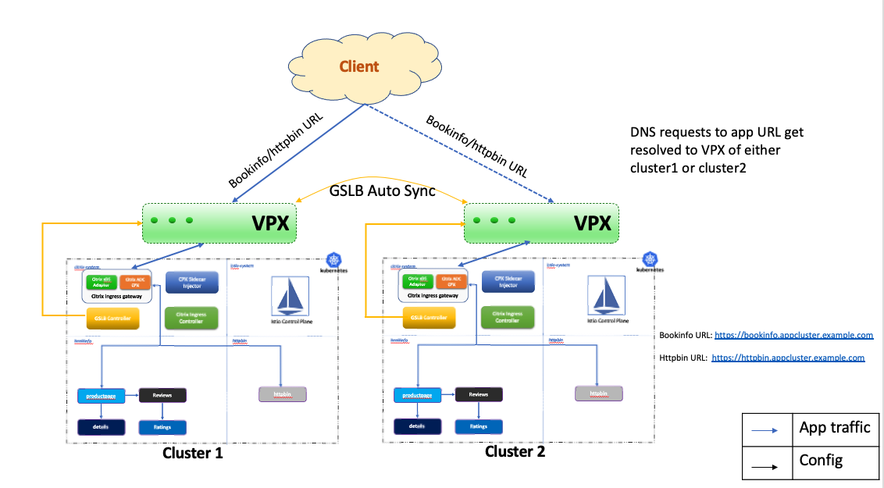
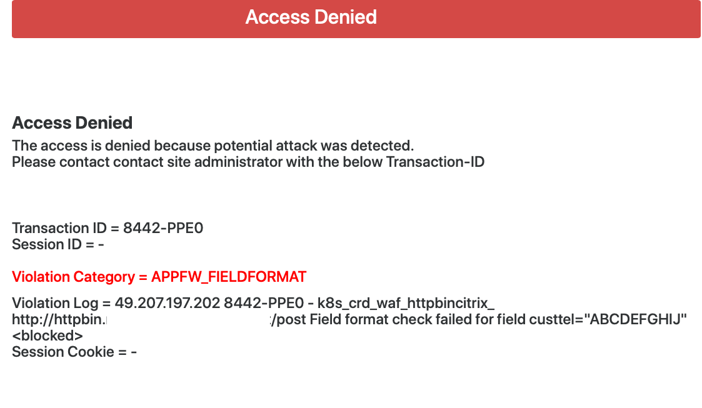
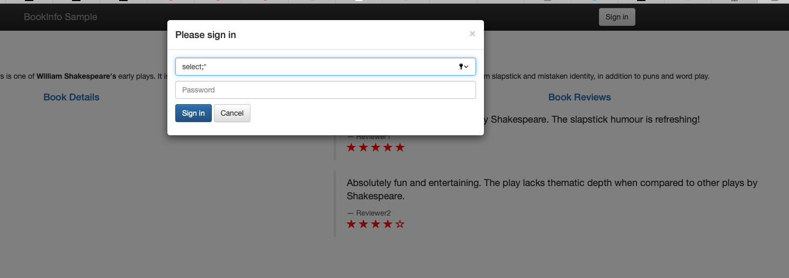
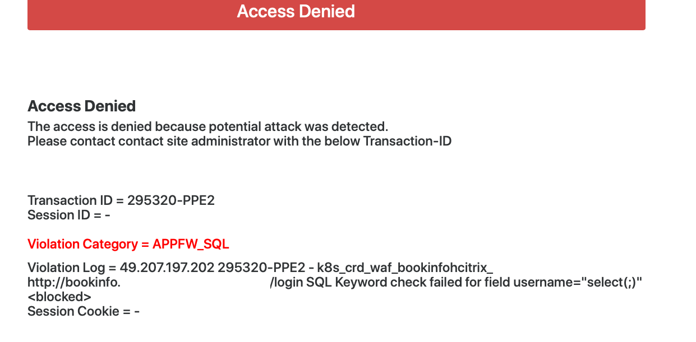

# Application security and continuous availability using Citrix WAF and GSLB in Citrix powered Service mesh in AWS

This guide provides a comprehensive example for:

i) Deploying the multiple applications ([Bookinfo](https://github.com/istio/istio/tree/master/samples/bookinfo) and [Httpbin](https://github.com/istio/istio/blob/master/samples/httpbin/httpbin.yaml))in Istio service mesh that has Citrix ADCs deployed as data plane proxies.

ii) Deploying Citrix Ingress Controller to expose Citrix ADC CPX Ingress Gateway Service and configuring [Web App Firewall (WAF)](https://docs.citrix.com/en-us/citrix-adc/current-release/application-firewall.html) on Citrix ADC VPX frontending the Kubernetes Cluster.

iii) Deploying Multi-cluster Ingress Controller for continuous availability and proximity based load balancing ([GSLB](https://docs.citrix.com/en-us/citrix-adc/current-release/global-server-load-balancing.html)).

# Table of Contents
   [Topology](#topology)

   A. [Creating EKS cluster in AWS](#bringup)

   B. [Deployment of Citrix ADC VPX ](#deploy-vpx)

   C. [Deploying Citrix ADC as Ingress Gateway](#citrix-ingress-gateway)

   D. [Generating wildcard Certificate and Key for applications](#generating-certificate)

   E. [Deploying Citrix ADC Sidecar Injector](#citrix-sidecar-injector)

   F. [Deploying Bookinfo and Httpbin](#deploying-bookinfo-httpbin)

   G. [Deploying Citrix Ingress Controller to expose Citrix ADC CPX as Gateway Service](#deploy-ingress-controller)

   H. [Deploying multi-cluster ingress controller for GSLB](#deploy-multi-cluster)

   I. [Route 53 configuration](#route53)

   J. [Traffic and Validation](#traffic)

   K. [WAF Usecases](#waf-validation)

# <a name="Topology">Topology</a>

The following diagram depicts the topology within a single cluster in which two applications, bookinfo and httpbin, are deployed in a separate namespace labelled for Citrix ADC CPX injection.

The following image depicts the overall topology of distributed Kubernetes clusters across different geographic regions. Each cluster has architecture shown in the preceding topology image.

**NOTE**
This example guide is mainly intended for AWS deployments. However, this document can be used for on-premise and other cloud platforms.

# <a name="bringup">A)Creating EKS cluster in AWS</a>
Follow the [guide](https://eksctl.io/usage/creating-and-managing-clusters/) to create EKS cluster in AWS.

# <a name="deploy-vpx">B)Deployment of Citrix ADC VPX </a>
Bring up Citrix ADC VPX instance in the same public subnet where EKS cluster is deployed in Step A.
Follow steps 7 - 10 from [this guide](https://docs.citrix.com/en-us/citrix-adc/current-release/deploying-vpx/deploy-aws/launch-vpx-for-aws-ami.html) to deploy Citrix ADC VPX instance.

**NOTE**

    •Citrix ADC VPX version 13.0-82.45 or later. 
    •Citrix ADC VPX needs to be created in public subnet with 3 Elastic IPs (one for NSIP, SNIP and VIP each)
    •Allow communication between Citrix ADC VPX and EKS clusters using security groups.
    •Allow ports 80/443 from internet to access the application deployed.
    •Allow ports 3008-3011, 53 and 22 for SNIPs in security group
    •Enable management access for SNIP using the following command:

        set ip <SNIP address> -mgmtaccess enabled

# <a name="citrix-ingress-gateway">C)Deploying Citrix ADC as Ingress Gateway</a>
Deploy Citrix ADC CPX as Ingress Gateway in `citrix-system` namespace using the following command:

    helm repo add citrix https://citrix.github.io/citrix-helm-charts/

    helm install citrix-adc-istio-ingress-gateway citrix/citrix-adc-istio-ingress-gateway --namespace citrix-system --set ingressGateway.EULA=YES --set citrixCPX=true  --set ingressGateway.secretVolumes[0].name=wildcard-cert,ingressGateway.secretVolumes[0].secretName=wildcard-cert,ingressGateway.secretVolumes[0].mountPath=/etc/istio/wildcard-cert,ingressGateway.nodePortRequired=true

# <a name="generating-certificate">D)Generating wildcard certificate and key for applications</a>

There are multiple tools available to generate certificates and keys. You can use your desired tool to generate the same in PEM format. Make sure that the names of key and certificate are *wildcard_key.pem* and *wildcard_cert.pem*. These are used to generate a Kubernetes secret *wildcard-cert* which is used by the Citrix ADC that acts as Ingress Gateway. Wildcard certificate is a single certificate used to secure multiple sub-domains pertaining to same base domain. In this example guide, base domain is `example.com` and sub-domain is `appcluster.example.com`. 

Perform the following steps to generate wildcard certificate and key using the `openssl` utility:

    kubectl create ns citrix-system
    
    openssl genrsa -out wildcard_key.pem 2048
    
    openssl req -new -key wildcard_key.pem -out wildcard_csr.pem -subj "/CN=*.appcluster.example.com"
    
    openssl x509 -req -in wildcard_csr.pem -sha256 -days 365 -extensions v3_ca -signkey wildcard_key.pem -CAcreateserial -out wildcard_cert.pem
    
    kubectl create -n citrix-system secret tls wildcard-cert --key wildcard_key.pem --cert wildcard_cert.pem    

# <a name="citrix-sidecar-injector">E)Deploying Citrix ADC Sidecar Injector</a>

Deploy a Citrix ADC CPX sidecar injector to inject Citrix ADC CPX as a sidecar proxy in an application pod in the Istio service mesh by using the following command:

      helm install cpx-sidecar-injector citrix/citrix-cpx-istio-sidecar-injector --namespace citrix-system --set cpxProxy.EULA=YES

# <a name="deploying-bookinfo-httpbin">F)Deploying Bookinfo and Httpbin</a>
In this example, the `bookinfo` and `httpbin` applications are deployed and exposed to outside the cluster using the Citrix ADC CPX Ingress Gateway. 
 
### F.1) Enable Namespace for Sidecar Injection
When a namespace is labelled with `cpx-injection=enabled`, Citrix ADC CPX is deployed as a sidecar proxy in the application pod. Label both `bookinfo` and `httpbin` namespace with `cpx-injection=enabled` using the following commands:
    
    kubectl create namespace bookinfo

    kubectl create namespace httpbin

    kubectl label namespace bookinfo cpx-injection=enabled

    kubectl label namespace httpbin cpx-injection=enabled

### F.2) Deploy the `Bookinfo` Application
To deploy the 'Bookinfo' application, use the following command:

    kubectl apply -n bookinfo -f https://raw.githubusercontent.com/citrix/citrix-helm-charts/master/examples/servicemesh_with_coe_and_adm/manifest/bookinfo.yaml  

### F.3) Deploy the `Httpbin` Application
To deploy the 'Httpbin' application, use the following command:

    kubectl apply -n httpbin -f https://raw.githubusercontent.com/citrix/citrix-helm-charts/master/examples/servicemesh_with_coe_and_adm/manifest/httpbin.yaml

### F.4) Configure Ingress Gateway and Virtual Service  for `Httpbin` and frontend `productpage` service of `Bookinfo` application
Run the following commands:

    kubectl apply -n bookinfo -f https://raw.githubusercontent.com/citrix/citrix-helm-charts/master/examples/Servicemesh_with_GSLB_and_WAF/manifest/bookinfo-gateway-wildcard.yaml

    kubectl apply -n httpbin -f https://raw.githubusercontent.com/citrix/citrix-helm-charts/master/examples/Servicemesh_with_GSLB_and_WAF/manifest/httpbin-gateway-wildcard.yaml

# <a name="deploy-ingress-controller">G)Deploying Citrix Ingress Controller to expose Citrix ADC CPX as Gateway Service </a>

### G.1)Create Kubernetes Secret for credential of Citrix ADC VPX
Create a Kubernetes secret `nslogin` with the login credentials of Citrix ADC VPX/MPX using the following command:
   
    kubectl create secret generic nslogin --from-literal=username=<username> --from-literal=password=<password> -n citrix-system

**Note:** Replace `<username>` and `<password>` with login credentials of Citrix ADC VPX

### G.2) Deploy Citrix Ingress Controller to configure Citrix ADC VPX as Ingress Device

To deploy Citrix Ingress Controller for configuring Citrix ADC VPX, run the following command:

    helm install cic citrix/citrix-ingress-controller --namespace citrix-system --set nsIP=<NSIP>,license.accept=yes,adcCredentialSecret=nslogin,ingressClass[0]=citrix-vpx,crds.install=true,ignoreNodeExternalIP=true

**NOTE**
Replace `<NSIP>` with Citrix ADC VPX private NSIP.

### G.3) Create Ingress Resource for CPX Gateway Service

To expose the CPX gateway service using Ingress resource, download the `vpx-ingress.yaml` file and update the annotation `ingress.citrix.com/frontend-ip` with the private VIP IP. After that, execute the kubectl apply command.

    wget https://raw.githubusercontent.com/citrix/citrix-helm-charts/master/examples/Servicemesh_with_GSLB_and_WAF/manifest/vpx-ingress.yaml

    kubectl apply -f vpx-ingress.yaml -n citrix-system

### G.4) Enabling WAF features on Citrix ADC VPX
In this subsection, two prominent use-cases of WAF are mentioned. The following features are used to secure application from the external traffic.

i) [Form Field Format Check](https://docs.citrix.com/en-us/citrix-adc/current-release/application-firewall/form-protections/field-formats-check.html)

ii) [SQL Injection Prevention](https://docs.citrix.com/en-us/citrix-adc/current-release/application-firewall/top-level-protections/html-sql-injection-check.html)

Download the `error.html` file and copy to the `/var/tmp` folder in Citrix ADC VPX. This `error.html` will be displayed on the browser whenever field format check fails or SQL injection attack is detected.

    wget https://raw.githubusercontent.com/citrix/citrix-helm-charts/master/examples/Servicemesh_with_GSLB_and_WAF/manifest/error.html

Deploy two CRDs for WAF in `citrix-system` namespace, using the following commands

    kubectl apply -n citrix-system -f https://raw.githubusercontent.com/citrix/citrix-helm-charts/master/examples/Servicemesh_with_GSLB_and_WAF/manifest/waffieldformat.yaml

    kubectl apply -n citrix-system -f https://raw.githubusercontent.com/citrix/citrix-helm-charts/master/examples/Servicemesh_with_GSLB_and_WAF/manifest/wafhtmlxsssql.yaml

# <a name="deploy-multi-cluster">H) Deploying multi-cluster ingress controller for GSLB</a>
For disaster recovery and continous availability of services, it is recommended to deploy applications in multiple Kubernetes clusters. Follow steps A to G for configuring GSLB across EKS clusters located in different AWS regions. Citrix Multi-cluster ingress controller is used for configuring GSLB setup across EKS cluster across multiple AWS regions.

**Manual Configurations need to be added before deploying Citrix multi-cluster ingress controller**

Add the configuration on both of the Citrix ADC VPX instances

    enable ns feature gslb
    add gslbsite <site1-Name> <privateIPofSNIP1> -publicIP  <publicIPofSNIP1>
    add gslbsite <site2-Name> <privateIPofSNIP2> -publicIP  <publicIPofSNIP2>
    
Add the following ADNS configuraion on Citrix ADC VPX in region-1.

    add service <serviceName> <PrivateIPofSNIP1> ADNS 53 

Add the following ADNS configuration on Citrix ADC VPX in region-2.
    
    add service <serviceName> <PrivateIPofSNIP2> ADNS 53

Consider Citrix ADC VPX in region-1 as master node for GLSB. Add the following configuration on Citrix ADC VPX on region-1 and validate the sync. Sync validation on master can be validated after all the sites are configured.
   
    set gslb parameter -automaticconfigsync enable
    
    sync gslb config -debug

### H.1) Deploy multi-cluster ingress controller for EKS cluster-1

For creating Kubernetes Secrets for both Citrix ADC VPX instances in cluster-1 run the following commands:

    kubectl create secret generic gslb-secret-cluster1 --from-literal=username=<username> --from-literal=password=<password> -n citrix-system

    kubectl create secret generic gslb-secret-cluster2 --from-literal=username=<username> --from-literal=password=<password> -n citrix-system

Download the `multicluster1.yaml` file. 

    wget https://raw.githubusercontent.com/citrix/citrix-helm-charts/master/examples/Servicemesh_with_GSLB_and_WAF/manifest/multicluster1.yaml

Update the `<region-1> and <region-2>` with the proper region names. Also, update the site-1-IP and site-2-IP with the Public SNIP IPs of Citrix ADC VPX instances in region-1 and region-2, respectively. Use the following command:

    helm install cluster1 citrix/citrix-multi-cluster-ingress-controller --namespace citrix-system -f multicluster1.yaml

**Deploy GTP (Global Traffic Policy) and GSE (Global Service Entry) for bookinfo application for cluster-1**

    wget https://raw.githubusercontent.com/citrix/citrix-helm-charts/master/examples/Servicemesh_with_GSLB_and_WAF/manifest/GSE_bookinfo_cluster1.yaml

    wget https://raw.githubusercontent.com/citrix/citrix-helm-charts/master/examples/Servicemesh_with_GSLB_and_WAF/manifest/GTP_bookinfo.yaml

**NOTE**
Replace `<region-1> and <region-2>` with the AWS regions and Endpoint in GSE with Public IP for VIP of Citrix ADC in region-1.

    kubectl apply -f GSE_bookinfo_cluster1.yaml -n bookinfo
    
    kubectl apply -f GTP_bookinfo.yaml -n bookinfo

**Deploy GTP (Global Traffic Policy) and GSE (Global Service Entry) for httpbin application for cluster-1**

    wget https://raw.githubusercontent.com/citrix/citrix-helm-charts/master/examples/Servicemesh_with_GSLB_and_WAF/manifest/GSE_httpbin_cluster1.yaml 

    wget https://raw.githubusercontent.com/citrix/citrix-helm-charts/master/examples/Servicemesh_with_GSLB_and_WAF/manifest/GTP_httpbin.yaml

**NOTE**
Replace `<region-1> and <region-2>` with the AWS regions and Endpoint in GSE with Public IP for VIP of Citrix ADC in region-1.

    kubectl apply -f GSE_httpbin_cluster1.yaml -n httpbin
    
    kubectl apply -f GTP_httpbin.yaml -n httpbin

### H.2) Deploy multi-cluster ingress controller for EKS cluster-2

For creating Kubernetes Secrets for both Citrix ADC VPX instances in cluster-2 run the following commands:

    kubectl create secret generic gslb-secret-cluster1 --from-literal=username=<username> --from-literal=password=<password> -n citrix-system

    kubectl create secret generic gslb-secret-cluster2 --from-literal=username=<username> --from-literal=password=<password> -n citrix-system

Download the `multicluster2.yaml` file. 

    wget https://raw.githubusercontent.com/citrix/citrix-helm-charts/master/examples/Servicemesh_with_GSLB_and_WAF/manifest/multicluster2.yaml

Update the `<region-1> and <region-2>` with the proper region names. Also, update the site-1-IP and site-2-IP with the Public SNIP IPs of Citrix ADC VPX instances in region-1 and region-2, respectively. Use the following command:

    helm install cluster2 citrix/citrix-multi-cluster-ingress-controlle --namespace citrix-system -f multicluster2.yaml

**Deploy GTP (Global Traffic Policy) and GSE (Global Service Entry) for bookinfo application for cluster-2**

    wget https://raw.githubusercontent.com/citrix/citrix-helm-charts/master/examples/Servicemesh_with_GSLB_and_WAF/manifest/GSE_bookinfo_cluster2.yaml

    wget https://raw.githubusercontent.com/citrix/citrix-helm-charts/master/examples/Servicemesh_with_GSLB_and_WAF/manifest/GTP_bookinfo.yaml

**NOTE**
Replace `<region-1> and <region-2>` with the AWS regions and Endpoint in GSE with Public IP for VIP of Citrix ADC in region-2.

    kubectl apply -f GSE_bookinfo_cluster2.yaml -n bookinfo
    
    kubectl apply -f GTP_bookinfo.yaml -n bookinfo

**Deploy GTP (Global Traffic Policy) and GSE (Global Service Entry) for httpbin application for cluster-2**

    wget https://raw.githubusercontent.com/citrix/citrix-helm-charts/master/examples/Servicemesh_with_GSLB_and_WAF/manifest/GSE_httpbin_cluster2.yaml 

    wget https://raw.githubusercontent.com/citrix/citrix-helm-charts/master/examples/Servicemesh_with_GSLB_and_WAF/manifest/GTP_httpbin.yaml

**NOTE**
Replace `<region-1> and <region-2>` with the AWS regions and Endpoint in GSE with Public IP for VIP of Citrix ADC in region-2.

    kubectl apply -f GSE_httpbin_cluster2.yaml -n httpbin
    
    kubectl apply -f GTP_httpbin.yaml -n httpbin

Citrix ADC CPX deployed as Ingress Gateway, accepts the packet with SNI. Since, multi-cluster ingress gateway needs an enhancement on creating monitors with [SNI](https://datatracker.ietf.org/doc/html/rfc6066#section-3) enabled, a few manual configurations are required in master.

    add ssl profile gslbsslbookinfo -sslProfileType BackEnd  -SNIEnable ENABLED -commonName monitor.appcluster.example.com
    
    add ssl profile gslbsslhttpbin -sslProfileType BackEnd -SNIEnable ENABLED -commonName monitor.appcluster.example.com

The lb monitors needs to be updated with the manually added SSL Profile. 
Get lb monitor name for bookinfo application and set the ssl profile using following command:

    sh run | grep -i "Host: bookinfo" 

    set lb monitor <monitor name> HTTP -respCode 200 -httpRequest "HEAD /" -customHeaders "Host: bookinfo.appcluster.example.com\r\n" -secure YES -sslProfile gslbsslbookinfo
    
Get lb monitor name for httpbin application and set the ssl profile using following command:

    sh run | grep -i "Host: httpbin"

    set lb monitor <monitor-name> HTTP -respCode 200 -httpRequest "HEAD /" -customHeaders "Host: httpbin.appcluster.example.com\r\n" -secure YES -sslProfile gslbsslhttpbin

# <a name="route53">I)Route 53 configuration</a>
Add Route53 entry for sub-domain nameserver to point to GSLB ADNS IPs in AWS.

`Base Domain : example.com`

`Sub-domain: appcluster.example.com`

Add `A` record for sub-domain nameserver `ns1.appcluster.example.com` to point to GSLB ADNS IPs(Public IP for the SNIP of VPX of both regions).

# <a name="traffic">J)Traffic and Validation</a>

You can open the URLs `bookinfo.appcluster.example.com` and `httpbin.appcluster.example.com` with HTTP and Secure HTTP in browser.

You can use `dig` tool to validate if DNS queries getting resolved to which Public IP for VIP of Citrix ADC VPX deployed in EKS cluster.

**Continuous availability of application in the event of Application going down**

You can disable/delete any one of the applications in one of the EKS clusters and use 'dig' to verify if DNS queries are resolved with VIP of the other cluster.

# <a name="waf-validation">K)Validating WAF</a>

### K.1) Form Field Format Check

1. Open the URL `https://httpbin.appcluster.example.com` in the browser.

2. Click the `HTML Forms` at the end of the httpbin page.

3. Fill the form with valid inputs execpt the Telephone field. Provide alphabets in the Telephone bill.

4. Click `Submit Order`

5. As form validation for the Telephone fails, an `access-denied` page will be displayed.

### K.2) SQL Injection Prevention

1. Open the URL `https://bookinfo.appcluster.example.com/productpage`

2. Click `Sign in`.

3. In the input box of `Username` provide `select;*`

4. Click `Sign in`.

5. `Access Denied` page will be displayed as Citrix ADC VPX detects and prevents SQL Injection Attack.

