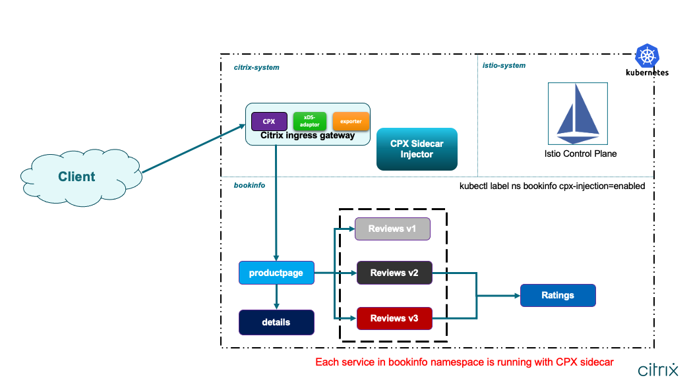
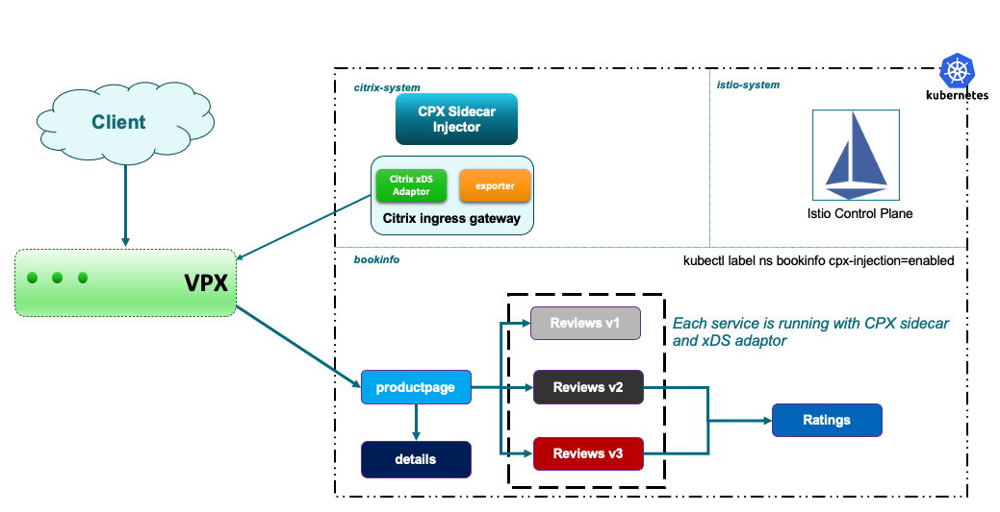

# Citrix ADC as Ingress Gateway and Sidecar Proxy for Bookinfo Application

Bookinfo application is the Helloworld of Istio environment. This application displays information about a book such as brief description, book details and couple of reviews. Details of the bookinfo app can be found on [Istio examples](https://istio.io/docs/examples/bookinfo/).

# Table of Contents
1. [Generating Certificate and Key for the Bookinfo application](#generating-certificate) 
2. [Deploying Citrix ADC as Ingress Gateway](#citrix-ingress-gateway)
3. [Deploying Citrix ADC Sidecar Injector](#citrix-sidecar-injector)
4. [Deploying Bookinfo](#deploying-bookinfo)
5. [Verification](#verification)
6. [Clean Up](#cleanup)

[Topology](#topology)

Citrix ADC CPX as an Ingress Gateway



Citrix ADC VPX as Ingress Gateway



# <a name="generating-certificate">A) Generating Certificate and Key for the `Bookinfo` application </a>

There are multiple tools available to generate certificates and keys. You can use your desired tool to generate the same in PEM format. Make sure that the names of key and certificate are *bookinfo_key.pem* and *bookinfo_cert.pem*. These are used to generate a Kubernetes secret *citrix-ingressgateway-certs* which is used by the Citrix ADC that acts as Ingress Gateway.

Perform the following steps to generate certificate and key using `openssl` utility:

### Generate private key for the `Bookinfo` application

      openssl genrsa -out bookinfo_key.pem 2048

### Generate Certificate Signing Request for the `Bookinfo` application
Common Name(CN/Server FQDN) for the `Bookinfo` application is fixed as `www.bookinfo.com`.

      openssl req -new -key bookinfo_key.pem -out bookinfo_csr.pem -subj "/CN=www.bookinfo.com"

### Generate Self-Signed Certificate for the `Bookinfo` application

      openssl x509 -req -in bookinfo_csr.pem -sha256 -days 365 -extensions v3_ca -signkey bookinfo_key.pem -CAcreateserial -out bookinfo_cert.pem

### Create a Kubernetes secret for certificate of `Bookinfo` application

Create a secret `citrix-ingressgateway-certs` using the certificate and key generated in the earlier step. Make sure that this secret is created in the same namespace where the Ingress Gateway is deployed.

      kubectl create -n citrix-system secret tls citrix-ingressgateway-certs --key bookinfo_key.pem --cert bookinfo_cert.pem

## <a name="citrix-ingress-gateway">B) Deploying Citrix ADC as Ingress Gateway</a>

Either Citrix ADC CPX or VPX/MPX can be deployed as an Ingress Gateway.

### To deploy Citrix ADC CPX as an Ingress Gateway:

       helm repo add citrix https://citrix.github.io/citrix-helm-charts/

       helm install citrix-adc-istio-ingress-gateway citrix/citrix-adc-istio-ingress-gateway --namespace citrix-system --set ingressGateway.EULA=YES --set citrixCPX=true

### To deploy Citrix ADC VPX or MPX as an Ingress Gateway:

       kubectl create secret generic nslogin --from-literal=username=<citrix-adc-user> --from-literal=password=<citrix-adc-password> -n citrix-system

       helm repo add citrix https://citrix.github.io/citrix-helm-charts/

       helm install citrix-adc-istio-ingress-gateway citrix/citrix-adc-istio-ingress-gateway --namespace citrix-system --set ingressGateway.EULA=YES ingressGateway.netscalerUrl=https://<Management IP> --set ingressGateway.vserverIP=<Virtual Service IP> --set secretName=nslogin

**Note:** Replace `management IP` address with Citrix ADC VPX/MPX management IP address, `Virtual Service IP` address as IP address to which `Bookinfo` application is exposed.

- **Important Note:** For deploying Citrix ADC VPX or MPX as ingress gateway, you should establish the connectivity between Citrix ADC VPX or MPX and cluster nodes. This connectivity can be established by configuring static routes on Citrix ADC as mentioned [here](https://github.com/citrix/citrix-k8s-ingress-controller/blob/master/docs/network/staticrouting.md) or by deploying [Citrix Node Controller](https://github.com/citrix/citrix-k8s-node-controller).

To know more about deploying Citrix Ingress Gateway using Helm Charts refer [this](https://github.com/citrix/citrix-helm-charts/tree/master/citrix-adc-istio-ingress-gateway). 

## <a name="citrix-sidecar-injector">C) Deploying Citrix ADC Sidecar Injector </a>
Deploy a Citrix ADC CPX sidecar injector to inject Citrix ADC CPX as a sidecar proxy in an application pod in the Istio service mesh by using the following command:

    helm repo add citrix https://citrix.github.io/citrix-helm-charts/

    helm install cpx-sidecar-injector citrix/citrix-cpx-istio-sidecar-injector --namespace citrix-system --set cpxProxy.EULA=YES

To know more about deploying Citrix ADC Sidecar Injector refer [this](https://github.com/citrix/citrix-helm-charts/tree/master/citrix-cpx-istio-sidecar-injector).

## <a name="deploying-bookinfo">D) Deploying Bookinfo</a>

In this example, bookinfo application is deployed and exposed to the cluster-external world using Istio Gateway resource. Step-by-step guide to deploy all necessary resources related to bookinfo application is given below.

## D.1) Deploy Bookinfo application 

Bookinfo application can either be deployed using helm chart or deployment yaml files. If you want to deploy bookinfo along with Citrix ADC CPX as sidecar proxies, then make sure that [Citrix ADC Sidecar Injector](../../citrix-cpx-istio-sidecar-injector/README.md) is deployed, and the namespace is labeled with `cpx-injection=enabled`.

## Enable Namespace for Sidecar Injection

```
kubectl create namespace bookinfo

kubectl label namespace bookinfo cpx-injection=enabled

```
## Deploy the `Bookinfo` Application

```
kubectl apply -n bookinfo -f https://raw.githubusercontent.com/citrix/citrix-helm-charts/master/examples/citrix-adc-in-istio/bookinfo/deployment-yaml/bookinfo.yaml  

```

## Configuring Ingress Gateway for Bookinfo 

Ingress Gateway can be configured using Istio Gateway resource for secure (https) as well as plain http traffic. 

### Configure HTTPS Gateway

```
kubectl apply -n bookinfo -f https://raw.githubusercontent.com/citrix/citrix-helm-charts/master/examples/citrix-adc-in-istio/bookinfo/deployment-yaml/bookinfo_https_gateway.yaml

```

### Configure HTTP Gateway

```
kubectl apply -n bookinfo -f https://raw.githubusercontent.com/citrix/citrix-helm-charts/master/examples/citrix-adc-in-istio/bookinfo/deployment-yaml/bookinfo_http_gateway.yaml
```

## Traffic Management using VirtualService 

Create [VirtualService](https://istio.io/docs/reference/config/istio.networking.v1alpha3/#VirtualService) for productpage service which is a frontend microservice of bookinfo app.

```
kubectl apply -n bookinfo -f https://raw.githubusercontent.com/citrix/citrix-helm-charts/master/examples/citrix-adc-in-istio/bookinfo/deployment-yaml/productpage_vs.yaml

```

## <a name="verification">E) Verification</a>

### I) If Citrix ADC VPX/MPX is running as an Ingress Gateway Device

Access bookinfo's frontend application using curl. 200 OK response should be returned by the productpage.

```
curl -kvi --resolve www.bookinfo.com:443:$VIP https://www.bookinfo.com/productpage

curl -kv http://$VIP/productpage -H "Host: www.bookinfo.com"
```

**NOTE** Replace $VIP with the Virtual IP address configured on Citrix ADC VPX/MPX.

Visit https://www.bookinfo.com/productpage from browser. Make sure that **DNS entry for www.bookinfo.com is created with $VIP on client device** (Usually an entry in /etc/hosts on Unix flavoured machines). 

### II) If Citrix ADC CPX is running as Ingress Gateway Device

1. Determine the Ingress IP

```
export INGRESS_HOST=$(kubectl get pods -l app=citrix-ingressgateway -n citrix-system -o 'jsonpath={.items[0].status.hostIP}')
```

2. Access bookinfo's frontend application using curl. 200 OK response should be returned by the productpage.

```
  curl -kvi --resolve www.bookinfo.com:31443:$INGRESS_HOST https://www.bookinfo.com:31443/productpage

  curl -kv http://$INGRESS_HOST:30180/productpage -H "Host: www.bookinfo.com"
```

3. Visit https://www.bookinfo.com:31443/productpage from browser. Make sure that **DNS entry for www.bookinfo.com is created with $INGRESS_HOST on client device** (Usually an entry in /etc/hosts on Unix flavoured machines)

## <a name="cleanup">F) Clean Up </a>

Delete the Gateway configuration, VirtualService and the secret, and shutdown the bookinfo application.

```
kubectl delete -n bookinfo -f https://raw.githubusercontent.com/citrix/citrix-helm-charts/master/examples/citrix-adc-in-istio/bookinfo/deployment-yaml/bookinfo_http_gateway.yaml

kubectl delete -n bookinfo -f https://raw.githubusercontent.com/citrix/citrix-helm-charts/master/examples/citrix-adc-in-istio/bookinfo/deployment-yaml/bookinfo_https_gateway.yaml

kubectl delete -n bookinfo -f https://raw.githubusercontent.com/citrix/citrix-helm-charts/master/examples/citrix-adc-in-istio/bookinfo/deployment-yaml/productpage_vs.yaml

kubectl delete secret -n citrix-system citrix-ingressgateway-certs

kubectl delete -n bookinfo -f https://raw.githubusercontent.com/citrix/citrix-helm-charts/master/examples/citrix-adc-in-istio/bookinfo/deployment-yaml/bookinfo.yaml

kubectl delete namespace bookinfo
```
